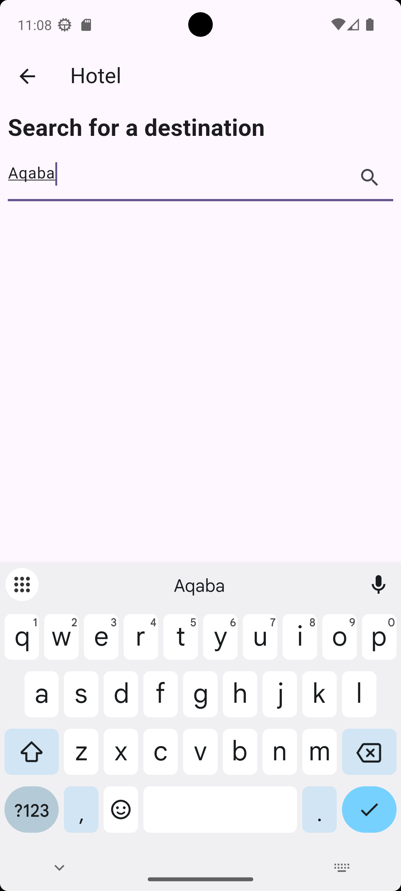
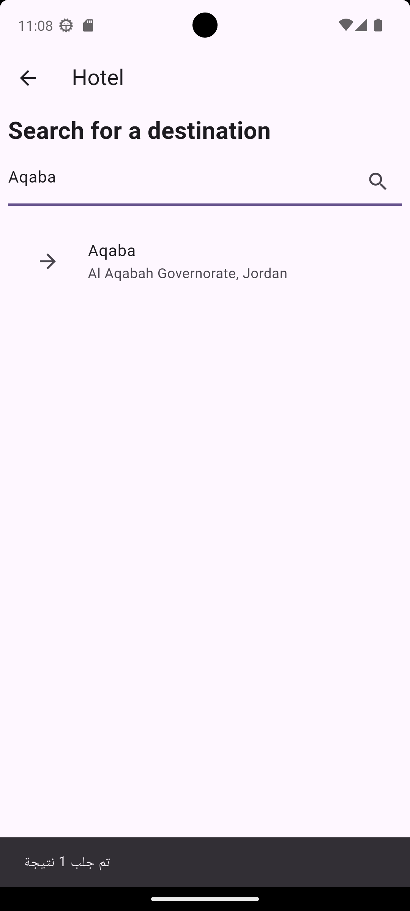
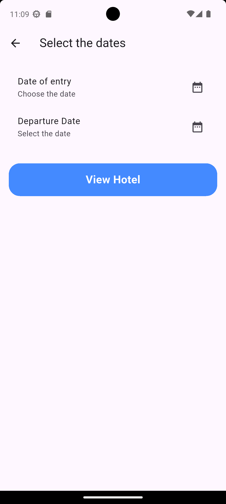
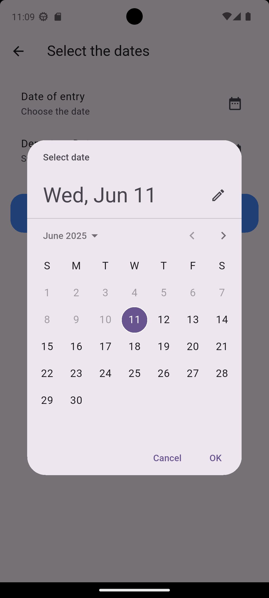
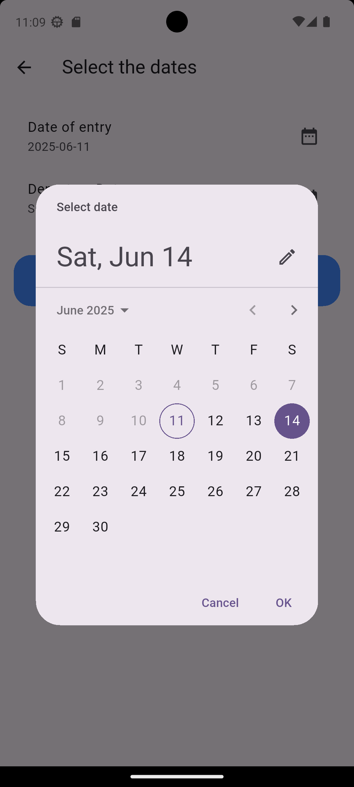
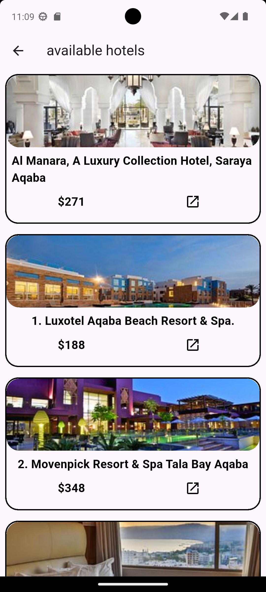
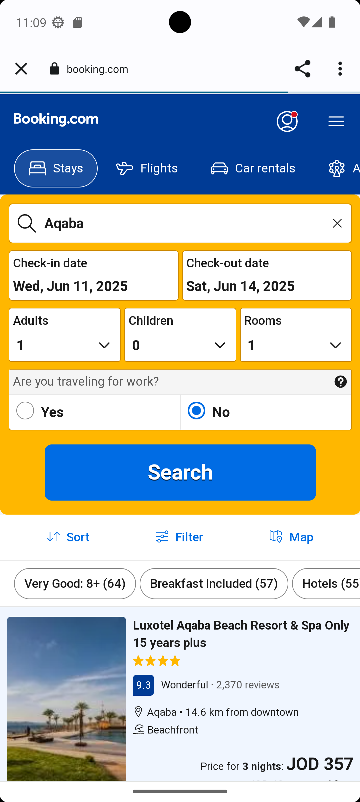

# tg_globle_app

تطبيق **tg_globle_app** يعرض واجهات متعددة تشمل شاشة الترحيب (SplashScreen)، الصفحة الرئيسية (HomePage)، صفحة الفنادق (HotelPage)، وصفحة المطاعم (RestaurantPage). يتم استخدام **Flutter** لبناء التطبيق مع استخدام **API** من **TripAdvisor** لجلب البيانات.

---

## التكنولوجيات المستخدمة

- **Flutter** (إطار عمل لبناء التطبيقات عبر الأنظمة)
- **Dart** (لغة البرمجة)
- **HTTP** (لإجراء طلبات API)
- **Provider** (لإدارة الحالة)
- **url_launcher** (لإطلاق الروابط الخارجية)

---

## الصفحات في التطبيق

### 1. **SplashScreen**

تظهر شاشة الترحيب عند فتح التطبيق، وتظل لمدة 5 ثوانٍ ثم يتم التبديل إلى الصفحة الرئيسية.

- **المكونات**: صورة شعار + تحميل (CircularProgressIndicator)


### 2. **HomePage**

الصفحة الرئيسية التي تحتوي على شريط بحث للبحث عن المدن أو المناطق.

- **المكونات**: 
  - شريط بحث لاختيار المدينة.
  - عرض نتائج البحث بناءً على اختيار المدينة من قائمة المدن المعروضة.

**الشكل**:


### 3. **HotelPage**

تحتوي هذه الصفحة على عرض للفنادق المتاحة بناءً على `geoId` و **تواريخ الوصول والمغادرة**.

- **المكونات**: 
  - اختيار تواريخ الوصول والمغادرة.
  - عرض الفنادق المقترحة بناءً على التواريخ المدخلة.
  - اسم الفندق، السعر، صورة الفندق، ورابط للحجز.

**الشكل**:

 









### 4. **RestaurantPage**

عرض المطاعم بناءً على `locationId`. يتم عرض اسم المطعم، التقييم، السعر، صورة، ورابط المراجعات.

- **المكونات**: 
  - استعراض المطاعم بناءً على الموقع.
  - رابط المراجعات الخاصة بكل مطعم.

**الشكل**:


---

## طريقة التشغيل

### 1. تحميل المشروع

```bash
git clone https://github.com/mohmmadabdr/tg_globle_app.git
